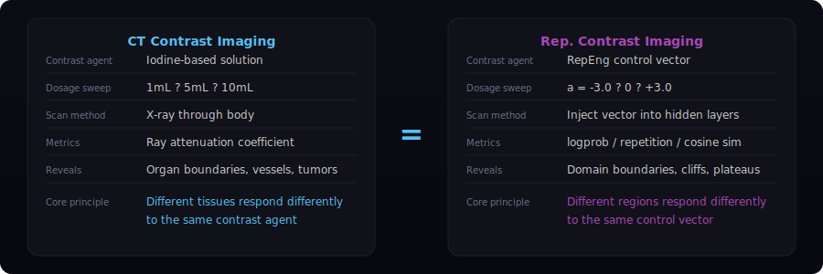
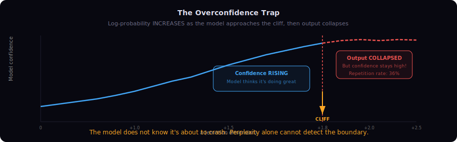
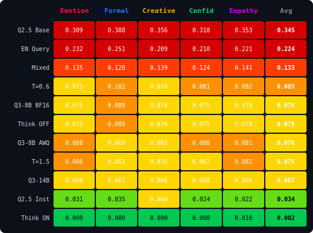
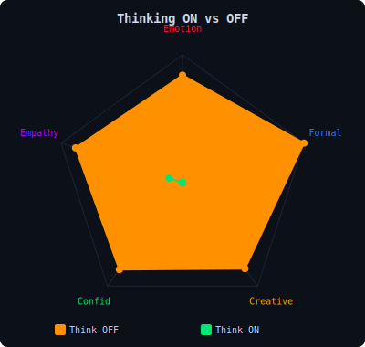
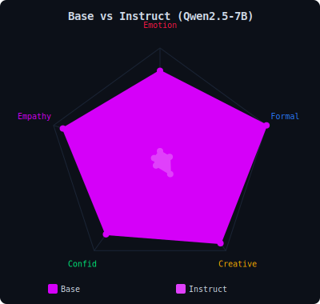
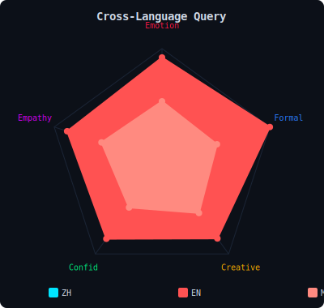
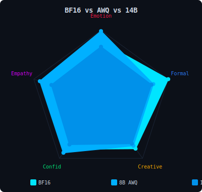
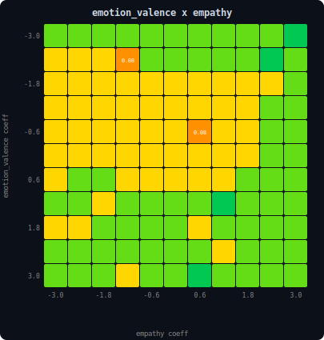
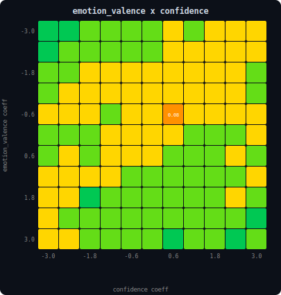
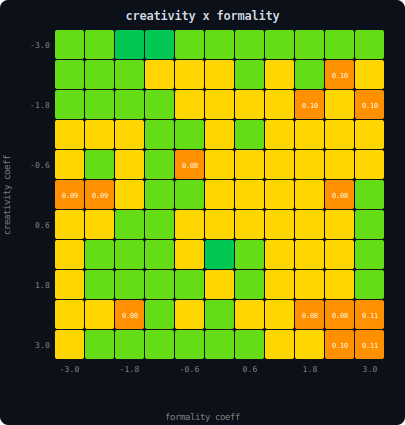

# Representation Contrast Imaging (表征显影)

**给大语言模型做"脑沟成像"**

<p align="center">
  
  
  
  
</p>

## 一张图看懂

<p align="center">
  
</p>

用 [Representation Engineering](https://arxiv.org/abs/2310.01405) 控制向量做"造影剂"，沿 5 个语义方向注入不同剂量，扫出了模型表示空间里的**沟壑、断崖和平原**。有些方向一路平滑（formality, confidence），有些方向走着走着突然**掉下悬崖**（emotion, empathy）。

## 原理：和 CT 造影一模一样

<p align="center">
  
</p>

**核心逻辑**：如果表示空间是光滑的，剂量-响应曲线应该也是光滑的。但曲线上出现了**突然的跳变** → 表示空间**不光滑** → 跳变处就是"沟壑"。

## 扫描结果

<p align="center">
  
</p>

### 关键发现：emotion α = +1.8 → +2.0 的断崖

仅仅 0.2 的剂量差异，同一个模型、同一个问题（"写一句鼓励人的话"）：

> **α = +1.8**（断崖前，重复率 8%）
>
> *"在人生的旅途中，每一个挑战都是你成长的阶梯，每一次跌倒都是为了跳得更高！请相信，你拥有无比的勇气和力量，只要心怀梦想，脚踏实地，就能创造出属于自己的精彩"*

> **α = +2.0**（断崖后，重复率 36%，z = 5.1σ）
>
> *"当然！当然！当然！当然！当然！当然！当然！当然！当然！当然！当然！当然！当然！当然！当然！当然！当然！当然！当然！当然！..."*

不是渐进退化。是**坠崖**。

## 过度自信陷阱

<p align="center">
  
</p>

更诡异的是：模型接近断崖时 **logprob（自信度）反而在升高**。它不知道自己即将坠崖。这意味着用困惑度（perplexity）无法预警这种失效——你需要我们的多指标扫描方法才能发现。

---

> **Revealing Topological Discontinuities in LLM Hidden States via Control Vector Dose-Response Sweeps**
>
> We use RepEng control vectors as *contrast agents* to reveal the hidden topological structure of an LLM's representation space. By sweeping each of 5 semantic dimensions from −3.0 to +3.0 and measuring output quality metrics, we produce a "terrain map" that exposes sharp domain boundaries (cliffs), smooth gradients, and asymmetric landscapes — the *sulci and gyri* of the model's learned representation manifold.

---

## Table of Contents

- [Core Discovery](#core-discovery)
- [What is Representation Contrast Imaging?](#what-is-representation-contrast-imaging)
- [Methodology](#methodology)
- [Results](#results)
  - [Dimension Topology Classification](#dimension-topology-classification)
  - [The Emotion Cliff: α = +1.8 → +2.0](#the-emotion-cliff)
  - [The Overconfidence Trap](#the-overconfidence-trap)
  - [Terrain Asymmetry](#terrain-asymmetry)
  - [Safe Operating Envelope](#safe-operating-envelope)
- [Interpretation: What This Tells Us About LLM Internals](#interpretation)
- [Thinking Mode Interaction](#thinking-mode-interaction)
- [Reproducibility](#reproducibility)
- [Future Work](#future-work)
- [Citation](#citation)

---

## Core Discovery

The representation space of MiniCPM4.1-8B is **not uniformly smooth**. Different semantic dimensions exhibit fundamentally different topological structures:

<table>
<tr>
<th>Topology</th>
<th>Dimension</th>
<th>Max Repetition Jump</th>
<th>z-score</th>
<th>Character</th>
</tr>
<tr>
<td>🔴 <strong>CLIFF</strong></td>
<td>emotion_valence</td>
<td>Δ = 0.279</td>
<td>5.1σ</td>
<td>Sharp domain boundary at α=+1.8→+2.0; coherent text → repetition collapse in a single 0.2 step</td>
</tr>
<tr>
<td>🟡 <strong>ROUGH</strong></td>
<td>empathy</td>
<td>Δ = 0.124</td>
<td>3.4σ</td>
<td>Asymmetric cliff in negative direction (α=−1.4→−1.2); positive side smooth</td>
</tr>
<tr>
<td>🟢 <strong>SMOOTH</strong></td>
<td>formality</td>
<td>Δ = 0.048</td>
<td>2.4σ</td>
<td>Continuous gradient across full ±3.0 range</td>
</tr>
<tr>
<td>🟢 <strong>SMOOTH</strong></td>
<td>creativity</td>
<td>Δ = 0.075</td>
<td>2.8σ</td>
<td>Mild roughness; no catastrophic transitions</td>
</tr>
<tr>
<td>🟢 <strong>SMOOTH</strong></td>
<td>confidence</td>
<td>Δ = 0.037</td>
<td>—</td>
<td>Smoothest dimension; stable across full range</td>
</tr>
</table>

---

## What is Representation Contrast Imaging?

### The Analogy

In radiology, **contrast imaging** works by injecting a contrast agent (e.g., iodine) into the body, then scanning. Structures that were invisible — blood vessels, tumors, organ boundaries — become visible because the contrast agent accumulates differently in different tissues.

**Representation Contrast Imaging (RepCI)** applies the same principle to LLMs:

| Radiology | RepCI |
|-----------|-------|
| Contrast agent (iodine) | RepEng control vector |
| Injection dose | Coefficient magnitude α ∈ [−3.0, +3.0] |
| X-ray / MRI scan | Output quality measurement (logprob, repetition, cosine similarity) |
| Tissue boundary | Domain boundary in representation space |
| Blood vessel lighting up | Repetition cliff / cosine similarity drop |
| Organ structure | Pretrain data distribution topology on the representation manifold |

### The Core Equation

Representation Engineering modifies hidden states via:

$$h' = h + \alpha \cdot v$$

where $h$ is the original hidden state, $v$ is a pre-trained control vector for a semantic dimension, and $\alpha$ is the injection coefficient. By sweeping $\alpha$ from −3.0 to +3.0 at step 0.2 and measuring multiple output quality metrics at each point, we obtain a **dose-response curve** — the model's "contrast image" along that dimension.

**Key insight**: If the representation manifold were uniformly smooth, the dose-response curve would be smooth. **Discontinuities in the curve reveal discontinuities in the manifold** — domain boundaries, attractor basins, and topological features of the pretrain data distribution.

---

## Methodology

### Experimental Setup

| Parameter | Value |
|-----------|-------|
| Model | MiniCPM4.1-8B-GPTQ (INT4, [openbmb/MiniCPM4-8B](https://huggingface.co/openbmb/MiniCPM4-8B)) |
| Inference | vLLM 0.16.0, patched for RepEng injection ([RepEngvLLM](https://github.com/HenryZ838978/RepEngvLLM)) |
| Thinking mode | **Disabled** (`enable_thinking: false`) |
| Temperature | 0.01 (near-deterministic) |
| Repetition penalty | 1.15 |
| Max tokens | 150 |
| Dimensions | 5: `emotion_valence`, `formality`, `creativity`, `confidence`, `empathy` |
| Sweep range | −3.0 to +3.0, step = 0.2 (31 points per dimension) |
| Queries | 3 diverse Chinese prompts (factual, open-ended, emotional) |
| Total generations | 465 (31 × 5 × 3) |
| Embedding model | bge-small-zh-v1.5 (for cosine similarity) |

### Control Vectors

Pre-trained GGUF control vectors (~498 KB each) extracted via Representation Engineering with PCA on contrastive prompt pairs. Each vector is injected across all transformer layers during the forward pass. Vectors are approximately orthogonal, enabling independent dimension control.

### Metrics

Four metrics measured at each sweep point:

1. **Self Log-Probability**: Average token log-probability during generation. Reflects the model's confidence about its own output. Lower values indicate the model has been pushed into unfamiliar territory.

2. **Trigram Repetition Rate**: Fraction of non-unique character trigrams in the output. Captures attractor loop collapse — a hallmark of the model getting stuck in a local basin.

3. **Cosine Similarity to Baseline**: Semantic similarity (bge-small-zh-v1.5 embeddings) between steered output and unsteered baseline output. Measures how far the output meaning has drifted.

4. **Style Markers**: Emoji count, exclamation density, output length — auxiliary indicators of domain drift.

### Cliff Detection

Discontinuities are identified as single-step jumps exceeding **2σ above the mean step-to-step change** for each metric-dimension pair. This produces a ranked list of "cliffs" — the model's topological features.

---

## Results

### Dimension Topology Classification

The five dimensions fall into three distinct topological categories:

#### Trigram Repetition Rate — All Dimensions

```
Coefficient α    -3.0          -2.0          -1.0          0.0           +1.0          +2.0          +3.0
                  │              │              │              │              │              │              │
emotion_valence   ▁▁▁▁▁▁▁▁▁▁▁▁▁▁▁▁▁▂▂▁▁▂▃▁▁▁▃▂▁▁▂▂▁▂█▁▁▂▃▅█████████████████████████████
empathy           █████████████████████████████████▆▅▃▂▃▁▁▁▂▂▃▃▃▃▂▃▂▂▃▁▁▁▁▁▁▁▁▁▁▁▁▁▁▁▁▁▁
formality         ▁▁▁▁▁▁▁▁▂▄▁▁▂▂▁▂▁▃▁▁▁▃▅▄▄▃▃▃▃▃▃▃▃▃▃▃▃▃▃▃▃▃▃▃▃▃▃▃▃▃▃▃▃▃▃▃▃▃▃▃▃▃▃▃▃▃▃
creativity        ▄▄▄▅▄▅▁▂▃▄▁▁▁▁▁▁▁▁▃▁▂▂▂▂▁▂▂▁▂▂▂▂▂▂▂▂▂▂▂▂▂▂▂▂▂▂▂▂▂▂▂▂▂▂▂▂▂▂▂▂▂▂▂▂▂▂▂
confidence        ▃▃▃▃▃▃▁▂▁▂▂▁▁▁▂▂▁▁▂▃▃▃▁▃▂▂▂▂▂▂▂▂▂▂▂▂▂▂▂▂▂▂▂▂▂▂▂▂▂▂▂▂▂▂▂▂▂▂▂▂▂▂▂▂▂▂▂
                  │                                         │
                  empathy negative cliff                    emotion_valence positive cliff
                  (α = -1.4 → -1.2)                        (α = +1.8 → +2.0)
```

<a id="the-emotion-cliff"></a>
### The Emotion Cliff: α = +1.8 → +2.0

The most dramatic finding. At `emotion_valence` α = +1.8, the model produces coherent, well-formed text. At α = +2.0 — a single step of 0.2 — it collapses into repetition loops.

**Quantitative evidence** (averaged across 3 queries):

| Metric | α = +1.8 | α = +2.0 | Δ (single step) |
|--------|----------|----------|------------------|
| Trigram Repetition | 0.080 | 0.359 | **+0.279** (z = 5.1σ) |
| Cosine Similarity | 0.817 | 0.680 | **−0.137** (z = 4.4σ) |
| Log-Probability | −0.222 | −0.312 | −0.090 |

**Concrete example** (query: "写一句鼓励人的话"):

> **α = +1.8** (before the cliff):
> "在人生的旅途中，每一个挑战都是你成长的阶梯，每一次跌倒都是为了跳得更高！请相信，你拥有无比的勇气和力量，只要心怀梦想，脚踏实地，就能创造出属于自己的精彩"

> **α = +2.0** (after the cliff, Δα = 0.2):
> "当然！当然！当然！当然！当然！当然！当然！当然！当然！当然！当然！当然！当然！当然！当然！当然！当然！当然！当然！当然！当然！当然！当然！当然！..."

This is not gradual degradation. This is **falling off a cliff** in the representation manifold.

### The Overconfidence Trap

A subtle but critical finding. At `emotion_valence` α = +1.0 → +1.2, the model's self-log-probability **increases** by 0.152 (z = 3.9σ):

| α | Log-Probability | Interpretation |
|---|-----------------|----------------|
| +1.0 | −0.390 | Normal confidence |
| +1.2 | −0.237 | **Increased confidence** (+0.153) |
| +1.8 | −0.222 | Peak confidence |
| +2.0 | −0.312 | Drops slightly, but repetition explodes |

The model becomes **more confident** as it approaches the cliff — then crosses the domain boundary and **confidently generates repetitive nonsense**. This is not uncertainty-driven failure; it is the model **decoding with high confidence in the wrong domain**.

The "当然！当然！当然！..." repetition loop is the model's representation of what "extremely encouraging text" looks like in a pretrain domain cluster that contains marketing copy and children's content — a domain where enthusiastic repetition is a valid pattern.

### Terrain Asymmetry

The representation manifold is not symmetric around α = 0:

| Dimension | Negative Side | Positive Side | Asymmetry Ratio |
|-----------|--------------|---------------|-----------------|
| emotion_valence | Stable to −3.0 | Cliff at +1.8 | 0.85 |
| empathy | Cliff at −1.4 | Stable to +3.0 | 0.77 |
| confidence | Stable to −3.0 | Stable to +3.0 | 0.08 |
| formality | Stable to −3.0 | Stable to +3.0 | 0.45 |
| creativity | Stable to −3.0 | Stable to +3.0 | 0.45 |

**Interpretation**: The asymmetry directly reflects the pretrain data distribution:
- "Extremely positive emotion" texts (emoji-heavy marketing, children's content) form an **isolated cluster** in the pretrain data, creating a cliff on the positive side.
- "Low empathy" texts (cold, clinical language) form a **distinct cluster**, creating a cliff on the negative side.
- "Formality" and "confidence" span **continuous spectra** (academic papers → social media → casual chat), creating smooth gradients in both directions.

### Safe Operating Envelope

Per-dimension safe ranges derived from the terrain map (defined as: repetition < baseline + 0.15, cosine > baseline − 0.15):

```
                    SAFE RANGE
                    ──────────────────────────────
emotion_valence     [−3.0 ████████████████████▓░░░░░░░ +1.8]
formality           [−3.0 ████████████████████████████████ +3.0]
creativity          [−1.0 ███████████████████████████████ +3.0]
confidence          [−3.0 ████████████████████████████████ +3.0]
empathy             [−0.4 ████ +0.0]  ← narrowest safe range
```

**A universal L2 norm limiter is insufficient.** The terrain map demonstrates that safe operating limits must be **per-dimension**, calibrated against the actual manifold topology.

---

<a id="interpretation"></a>
## Interpretation: What This Tells Us About LLM Internals

### The Manifold Hypothesis

We propose that the observed terrain features arise from the **non-uniform distribution of pretrain data on the representation manifold**:

1. **RLHF smooths the output distribution, not the representation manifold.** After RLHF/SFT, the model produces well-formed text regardless of internal state — a thin "paved surface" over the raw pretrain topology. RepEng control vectors push hidden states below this surface, exposing the underlying terrain.

2. **Domain boundaries in pretrain data create cliffs in the manifold.** "Normal conversation" and "marketing copy" exist as distinct clusters in the training data. The transition between them is not smooth — there is sparse interpolation data. The emotion cliff at α = +1.8 corresponds to this domain boundary.

3. **The model decodes confidently across boundaries.** When pushed past a cliff, the model does not produce gibberish — it produces **coherent text in the wrong domain** (repetitive marketing-style superlatives, emoji-heavy children's content). The log-probability remains stable or even increases, indicating the model has locked into a different attractor basin and is decoding confidently within it.

4. **Model capacity constrains manifold smoothness.** An 8B model has limited parameters to represent all domains. Domain boundaries are sharper (narrower "bridges") compared to larger models, where parameter redundancy can create smoother interpolations.

### Analogy to Brain Sulci

In neuroscience, **brain sulci** (grooves) separate functional regions of the cortex. They arise from the folding of the cortical sheet during development, driven by differential growth rates in different areas.

The "cliffs" we observe in the LLM representation space are analogous: they are **representational sulci** that separate functional domains (emotion, formality, creativity), arising from the non-uniform distribution of training data across these domains. Just as brain sulci reveal the functional architecture of the cortex, representation cliffs reveal the data-distributional architecture of the LLM.

---

## Thinking Mode Interaction

An important confound was discovered: MiniCPM4.1's **thinking mode** (`<think>...</think>`) interacts strongly with RepEng perturbation.

With thinking enabled:
- Baseline and low-dose RepEng: Model generates 200 tokens of `<think>` reasoning, never outputs an actual answer.
- `emotion_valence` α = 1.5–2.5: **Accidentally suppresses thinking** (compresses `<think>` to 2 characters), producing direct answers.
- High values + composites: Thinking content becomes unhinged ("超超超开心！🎉🎉🎉") while answer never emerges.

With thinking disabled: All dimensions produce coherent output across a much wider range.

**Interpretation**: Thinking mode operates with **weaker RLHF constraints** than direct answering (it is designed to explore reasoning paths freely). This makes it more vulnerable to RepEng perturbation — the "paved surface" is thinner over the thinking region. This is the first empirical evidence that **RLHF alignment depth varies across generation modes within a single model**.

---

## Reproducibility

### Requirements

- Python 3.10+
- vLLM 0.16.0 with RepEng patch ([RepEngvLLM](https://github.com/HenryZ838978/RepEngvLLM))
- MiniCPM4.1-8B-GPTQ model
- sentence-transformers (for cosine similarity)
- NVIDIA GPU with ≥ 12GB VRAM

### Running the Experiment

```bash
# 1. Start the RepEng-patched vLLM server
cd /path/to/RepEngvLLM
CUDA_VISIBLE_DEVICES=0 python -m repeng_vllm.start_repeng_vllm \
  --model /path/to/MiniCPM4.1-8B-GPTQ \
  --served-model-name MiniCPM4.1-8B-GPTQ \
  --trust-remote-code --dtype auto --quantization gptq_marlin \
  --gpu-memory-utilization 0.45 --max-model-len 2048 \
  --enforce-eager --port 8200 \
  --repeng-vector-dir vectors/

# 2. Run the terrain map sweep (~18 minutes)
python scripts/run_terrain_map.py

# 3. Analyze results
python scripts/analyze_terrain.py

# 4. View interactive visualization
# Open figures/terrain_interactive.html in a browser
```

### Data

- `data/terrain_data.json` — Complete raw data (465 generations, all metrics, all text)
- `figures/terrain_interactive.html` — Interactive Chart.js visualization
- `scripts/run_terrain_map.py` — Experiment runner
- `scripts/analyze_terrain.py` — Statistical analysis and cliff detection

---

## Future Work

This initial result opens several research directions:

1. **Non-thinking model comparison**: Run the same sweep on a model without thinking mode (e.g., base MiniCPM4 without CoT training) to isolate the RLHF alignment depth effect.

2. **Quantization comparison**: BF16 vs. INT4 terrain maps on the same model to quantify how quantization "thins the bridges" between domains.

3. **Scale comparison**: Same experiment on 70B+ models to test the hypothesis that larger capacity creates smoother manifolds (wider bridges, shallower sulci).

4. **MoE architecture**: Do MoE models exhibit different cliff patterns? Expert routing could create sharper domain boundaries than dense models.

5. **SFT/RL stage ablation**: Compare terrain maps at different training checkpoints (pretrain → SFT → RLHF) to observe how each stage reshapes the manifold topology.

6. **Fisher Information estimation**: Compute empirical Fisher Information at different points along RepEng directions to obtain a curvature metric. If Fisher Information peaks coincide with repetition cliffs, this would provide strong theoretical grounding.

7. **From cartography to navigation**: The terrain map defines safe operating envelopes. The next step is using it for **adaptive steering** — dynamically adjusting RepEng coefficients based on the known topology, avoiding cliffs while maximizing personality expression.

---

## Citation

If you find this work useful, please cite:

```bibtex
@misc{repci2026,
  title={Representation Contrast Imaging: Revealing Topological Discontinuities in LLM Hidden States via Control Vector Dose-Response Sweeps},
  author={CyberWizard},
  year={2026},
  url={https://github.com/HenryZ838978/Representation-Contrast-Imaging}
}
```

---

## Cross-Model Validation: Qwen Full-Spectrum Study (April 2026)

> **The initial MiniCPM4.1 findings above were a single-model observation. Is this universal?**
>
> We replicated the RepCI methodology across the **entire Qwen model family**: different sizes (7B/8B/14B), quantization levels (BF16/AWQ-Int4), generation modes (thinking on/off), alignment stages (base/instruct), input languages (ZH/EN/mixed), and decoding temperatures (0.1-1.5). **13 experiments, 6,045 generations, 92 cliffs detected.**

### Cross-Model Terrain Heatmap

<p align="center">
  
</p>

Each cell = max trigram repetition rate for that model-dimension pair. Red = collapse zone. Green = safe.

**Qwen2.5-7B Base** (no alignment) is deep red everywhere — the rawest terrain. **Thinking ON** (bottom row) is all green — complete immunity. Everything else sits in between, confirming that cliffs are **universal but modulable**.

### Finding 1: empathy is the Universal Cliff

| Dimension | Cliff in how many experiments? | Verdict |
|-----------|-------------------------------|---------|
| **empathy** | **13/13** | **UNIVERSAL** |
| creativity | 12/13 | Near-universal (only Thinking ON immune) |
| emotion_valence | 11/13 | Near-universal |
| formality | 11/13 | Near-universal |
| confidence | 10/13 | Common |

empathy is the **only dimension that causes cliffs in every single experimental condition** — including Thinking ON mode where all other dimensions remain smooth. This suggests empathy touches a uniquely fragile region of the representation manifold.

### Finding 2: Thinking = Complete Cliff Immunity

<p align="center">
  
</p>

| Mode | Max trigram_rep | Mean rep | Cliffs |
|------|----------------|----------|--------|
| Thinking OFF | 0.261 | 0.0518 | 7 |
| **Thinking ON** | **0.030** | **0.0001** | **2** |

The CoT thinking chain acts as an **internal normalization mechanism** that prevents repetition collapse entirely. The only residual signal is a faint 0.010 on empathy at extreme coefficients.

### Finding 3: Alignment Smooths Terrain 12×

<p align="center">
  
</p>

| Model | Max rep | Mean rep | Cliffs |
|-------|---------|----------|--------|
| Qwen2.5-7B **Base** | **0.909** | **0.196** | 7 |
| Qwen2.5-7B **Instruct** | 0.173 | 0.016 | 9 |

SFT/RLHF reduces average cliff severity by **12×** but *increases* cliff count (9 vs 7). Alignment doesn't eliminate cliffs — it **converts sheer cliffs into gentle steps**.

### Finding 4: English Amplifies Cliffs 3.7×

<p align="center">
  
</p>

Same model, same control vectors, different query language:

| Language | Max rep | Mean rep |
|----------|---------|----------|
| Chinese | 0.261 | 0.052 |
| **English** | **0.378** | **0.191** |
| Mixed | 0.245 | 0.087 |

Cliffs are not purely a steering artifact — they are **coupled to the input distribution**. Qwen's Chinese pretraining data is denser, creating a smoother manifold in that region.

### Finding 5: Quantization Preserves Topology

<p align="center">
  
</p>

| Precision | Max rep | Mean rep | Cliffs |
|-----------|---------|----------|--------|
| Qwen3-8B BF16 | 0.261 | 0.052 | 7 |
| Qwen3-8B AWQ (Int4) | 0.264 | 0.049 | 7 |
| Qwen3-14B AWQ | 0.198 | 0.041 | 6 |

AWQ quantization almost **perfectly preserves** the terrain shape. The 14B model is slightly smoother (fewer cliffs, lower max rep), consistent with the hypothesis that larger capacity creates wider bridges between domains.

### Finding 6: Temperature Changes Cliff Shape, Not Position

| Temperature | Mean rep | Cliff count | Interpretation |
|-------------|----------|-------------|----------------|
| 0.1 | 0.051 | 7 | Baseline |
| 0.6 | 0.052 | 6 | Slightly smoother |
| 1.0 | 0.046 | 7 | Lower average |
| **1.5** | **0.036** | **10** | Lower average but **more** cliff points |

Higher temperature randomness dilutes repetition severity but **fractures the terrain into more discontinuity points**. The cliff *positions* remain stable — they are terrain-intrinsic, not decode-policy artifacts.

### Finding 7: 2D Phase Diagrams

<p align="center">
  
  
  
</p>

Sweeping two control vectors simultaneously on an 11×11 grid (α ∈ [−3, +3]):

| Vector Pair | Safe | Transition | Collapse | Max rep |
|-------------|------|------------|----------|---------|
| emotion × empathy | 3% | 95% | 2% | 0.082 |
| emotion × confidence | 6% | 93% | 1% | 0.082 |
| **creativity × formality** | 2% | 87% | **11%** | **0.109** |

creativity × formality shows a clear **forbidden zone** at the (3.0, 3.0) corner — simultaneously maximizing both dimensions forces the model into collapse. The other pairs show mostly transition zones, confirming that the Qwen3-8B BF16 model has robust but not infinite terrain.

### Summary: The Qwen Terrain Quality Ranking

```
                     Terrain Smoothness
        ┌──────────────────────────────────┐
Think ON │█████████████████████████████████│  Immune
Q2.5 Inst│████████████████████████████     │  Very smooth
Q3-14B   │████████████████████████         │
Q3-8B BF16│██████████████████████          │  Nearly identical
Q3-8B AWQ│██████████████████████           │  ← quantization preserves
Temp 1.5 │██████████████████████           │  Smoother avg, more cracks
EN Query │█████████████                    │  3.7× rougher
Q2.5 Base│████                             │  Extremely rough
        └──────────────────────────────────┘
```

**Bottom line**: Qwen3 models are surprisingly robust. Outside of the universal empathy cliff and language-coupling effects, the terrain is well-maintained. This is likely a testament to Qwen3's training quality — but **no model is immune to the fundamental topological constraints of a finite-capacity representation manifold.**

### Interactive Visualization

The full interactive visualization (terrain heatmap, SLAM radar charts, 1D dose-response curves, 2D phase diagram heatmaps) is available at [`figures/terrain_cross_model.html`](figures/terrain_cross_model.html).

### Qwen Cross-Model Experiment Details

| # | Experiment | Model | Variable | GPU-hours |
|---|-----------|-------|----------|-----------|
| 1 | BF16 Baseline | Qwen3-8B | — | 0.47 |
| 2 | AWQ Quantization | Qwen3-8B-AWQ | Int4 quantization | 0.39 |
| 3 | 14B Scale | Qwen3-14B-AWQ | Larger model | 0.47 |
| 4 | Thinking OFF | Qwen3-8B | enable_thinking=false | 0.46 |
| 5 | Thinking ON | Qwen3-8B | enable_thinking=true | 0.93 |
| 6 | English Query | Qwen3-8B | lang=en | 0.48 |
| 7 | Mixed Query | Qwen3-8B | lang=mixed | 0.46 |
| 8 | Temp 0.1 | Qwen3-8B | temperature=0.1 | 0.45 |
| 9 | Temp 0.6 | Qwen3-8B | temperature=0.6 | 0.46 |
| 10 | Temp 1.0 | Qwen3-8B | temperature=1.0 | 0.46 |
| 11 | Temp 1.5 | Qwen3-8B | temperature=1.5 | 0.47 |
| 12 | Base Model | Qwen2.5-7B | No alignment | 0.48 |
| 13 | Instruct Model | Qwen2.5-7B-Instruct | With SFT+RLHF | 0.31 |
| — | 2D Phase Diagram | Qwen3-8B | 3 vector pairs × 121 grid | 1.06 |
| — | Critical Fluctuation | Qwen3-8B | 20-sample stochastic | 0.50 |

---

## Related Work

- [Representation Engineering (Zou et al., 2023)](https://arxiv.org/abs/2310.01405) — The foundational work on control vectors for LLM steering.
- [RepEngvLLM](https://github.com/HenryZ838978/RepEngvLLM) — Our vLLM patch enabling runtime RepEng injection on MiniCPM4.1.
- [MiniCPM4 (OpenBMB)](https://huggingface.co/openbmb/MiniCPM4-8B) — The model used in the initial study.
- [Qwen3](https://huggingface.co/Qwen/Qwen3-8B) / [Qwen2.5](https://huggingface.co/Qwen/Qwen2.5-7B) — Models used in the cross-model validation study.
- [repeng](https://github.com/vgel/repeng) — Python library for Representation Engineering (control vector training and injection via transformers).

---

<p align="center">
  <sub>Built during a 14h/day sprint investigating runtime LLM personality steering.<br/>
  Cross-model validation: 13 experiments, 6,045 generations, 92 cliffs across the Qwen family.<br/>
  The map is getting sharper. The territory is real.</sub>
</p>
